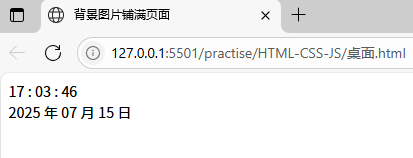
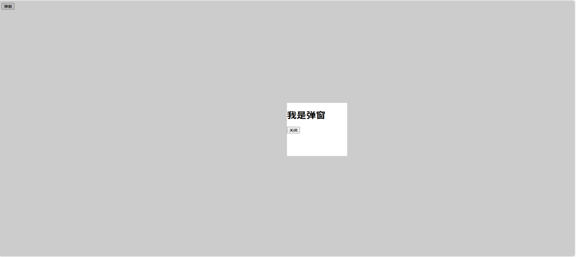

### 输出输入语句
```
Document.write(‘我是tmk’)               →内容显示在网页中
alert(‘请确认信息无误’)                 →页面上方弹窗警告（只有确定按钮）
Console.log(‘控制台打印’)               →内容显示在控制台中
Prompt(‘请输入您的姓名’)                →页面上弹出输入框窗口（有确定、取消按钮
```

<hr>

### 退出登录实操笔记
```
  logoutbtn() {
    const e = confirm("确定要退出登录吗？")
    if (e == true) { 
      localStorage.removeItem('userinfo');
      // alert("退出登录成功");
      // 重新刷新页面
      location.reload();
    } else {
      // alert("用户点击了取消按钮"); 
    }
  }
```

<hr>

### 字符串
<code>indexOf()</code><br>
解析：从index为0的地方开始查找，找到第一次出现的值并返回其index值<br>
举例:
```
const str = 'abcdecac';
console.log(str.indexOf('c')); //     打印机结果：2
```
<br>

<code>lastindexOf()</code><br>
解析：从index为0的地方开始查找，找到最后一次出现的值并返回index值<br>
举例:
```
const str = 'abcdecac';
console.log(str.lastIndexOf('c'));//     打印机结果：7
```
<br>

<code>索引值 = str.indexOf(想要查询的字符串, [起始位置])</code><br>
举例:
```
const str = 'abcdecac';
result = str.indexOf('c',3);
console.log(result);
// 从前往后数，字母c分别在下标为2、5、7处，但题目要求要从下标为3的位置开始数，所有下标为3及之前的都不算，所
以返回值为5
```
<br>

<code>search()</code><br>
解析：获取字符串中指定内容的索引（参数里一般是正则）<br>
举例:
```
const name = 'qianguyihao';
console.log(name.search('yi')); // 打印结果：6
```
<br>

<code>includes()</code><br>
解析：判断字符串中是否包含指定的内容<br>
举例:
```
const name = 'qianguyihao';
console.log(name.includes('yi')); 
 // 打印结果：true
console.log(name.includes('haha'));
// 打印结果：false
```
<br>

<code>startsWith()</code><br>
解析：字符串是否以指定的内容开头<br>
举例:
```
const name = 'abcdefg';
console.log(name.startsWith('a')); 
// 打印结果：true
```
<br>

<code>endsWith()</code><br>
解析：字符串是否以指定的内容结尾<br>
举例:
```
const name = 'abcdefg';
console.log(name.endsWith('f'));
 // 打印结果：false 
```
<br>

<code>slice()</code><br>
解析：字符串截取<br>
举例:
```
const name = 'abcdefg';
const str = name.slice(2, 5); 
console.log(str)
 //(2, 5) 截取时，包左不包右。(1, -1) 表示从第一个截取取到倒数第一个。打印结果：cde 
```
<br>

<code>substring()</code><br>
解析：注释：从字符串中截取指定的内容。和silce()类似。<br>
<br>

<code>substr()</code><br>
解析：从字符串中截取指定的内容<br>
举例:
```
const name = 'abcdefghi';
const a = name.substr(2, 5); 
console.log(a)
 // 从下标为2开始，截取5个字符。打印结果: cdefg
```
<br>

<code>String.fromCharCode()</code><br>
解析：字符串截取<br>
举例:
```
var result1 = String.fromCharCode(72);
var result2 = String.fromCharCode(20013);
console.log(result1); // 打印结果：H
console.log(result2);// 打印结果：中
```
<br>

<code>concat()</code><br>
解析：字符串的连接<br>
举例:
```
var str1 = 'qiangu';
var str2 = 'yihao';
var result = str1.concat(str2);
console.log(result); // 打印结果：qianguyihao
```
<br>

<code>split()</code><br>
解析：字符串转换为数组<br>
举例:
```
var str = 'qian, gu, yi, hao'; // 用逗号隔开的字符串
var array = str.split(',');
// 将字符串 str 拆分成数组，通过逗号来拆分
console.log(array); 
// 打印结果是数组：["qian", " gu", " yi", " hao"]
```
<br>

<code>replace()</code><br>
解析：字符串的替换<br>
举例:
```
var str2 = 'Today is fine day,today is fine day !';
console.log(str2);
console.log(str2.replace('today', 'tomorrow')); 
//只能替换第一个today
```
<br>

<code>repeat()</code><br>
解析：重复字符串<br>
举例:
```
const name = 'qianguyihao';
console.log(name.repeat(2));
// 打印结果：qianguyihaoqianguyihao
```
<br>

<code>slice</code><br>
解析：模糊字符串<br>
举例:
```
const telephone = '13088889999';
const tel = telephone.slice(0, -4) + '*'.repeat(4); 
console.log(tel); 
 // 打印结果：1308888****
```
<br>

<code>toLowerCase()</code>：转换成大写<br>
<code>toUpperCase()</code>：转换成小写<br>
举例:
```
var str = 'abcdEFG';
console.log(str.toLowerCase());//abcdefg
console.log(str.toUpperCase());//ABCDEFG
```
<br>

<code>trim()</code><br>
解析：去除首尾空格<br>
举例:
```
var str = '   abcdecac    ';
console.log(str.trim());  //abcdecac
```
<br>
<hr>

### JavaScript 制作计时器
```
<body>
  <div>
    <span id="HH"></span>
    <span>:</span>
    <span id="mm"></span>
    <span>:</span>
    <span id="ss"></span>
  </div>
  <div>
    <span id="NN"></span>
    <span>年</span>
    <span id="YY"></span>
    <span>月</span>
    <span id="RR"></span>
    <span>日</span>
  </div>
</body>
```
<br>

```
<script>
  window.onload = function(){
    setInterval(() => {
        var dt = new Date()
        var NN = dt.getFullYear()
        var YY = dt.getMonth()+1
        var RR = dt.getDate()
        var HH = dt.getHours()
        var mm = dt.getMinutes()
        var ss = dt.getSeconds()

        document.querySelector('#NN').innerHTML = padZero(NN)// 年
        document.querySelector('#YY').innerHTML = padZero(YY)// 月
        document.querySelector('#RR').innerHTML = padZero(RR)// 日 
        document.querySelector('#HH').innerHTML = padZero(HH)// 时
        document.querySelector('#mm').innerHTML = padZero(mm)// 分
        document.querySelector('#ss').innerHTML = padZero(ss)// 秒
    },1000)
  }
  function padZero(n){
    return n > 9 ? n : '0' + n
  }
</script>
```

<hr>

### js弹窗
```
<body>
    <!-- 注册点击事件，一点击就打开弹窗 -->
    <button onclick="showPopup()">弹窗</button>

    <div class="pop" id="pop">
        <div class="box">
            <h1>我是弹窗</h1>
            <!-- 注册点击事件，一点击就关闭弹窗 -->
            <button onclick="hidePopup()">关闭</button>
        </div>
    </div>
</body>
```
<br>

```
<style>
  .pop {
      position: fixed; /* 固定定位，不随页面滑动变化 */
      left: 0;
      top: 0;
      width: 100%;
      height: 100%;
      background-color: rgba(0, 0, 0, 0.2); /* 半透明背景 */
      display: none; /* 默认隐藏 */
  }
  .box {
      width: 200px;
      height: 200px;
      background-color: #fff;
      /* 弹窗始终居中于页面 */
      position: fixed; /* 固定定位，不随页面滑动变化 */
      left: 50%;
      top: 40%;
  }
</style>
```
<br>

```
<script>
  // showPopup()按钮一点击就更改 id="pop" 的样式为显示"
  function showPopup() {
      document.getElementById("pop").style.display = "block";
  }
  // hidePopup()按钮一点击就更改 id="pop" 的样式为隐藏"
  function hidePopup() {
      document.getElementById("pop").style.display = "none";
  }
</script>
```



