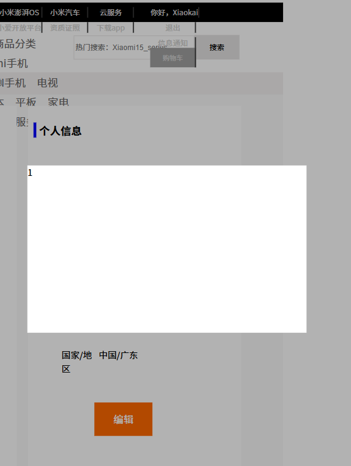
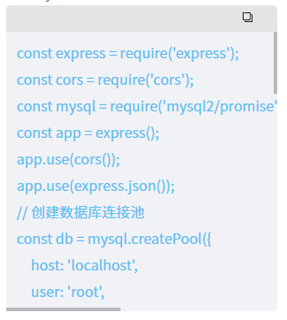

### CSS的盒子垂直居中
<!--  -->

<br>

```
<div class="window" v-show="isshow">
       <div class="window-center">1</div>
</div>
```
方法一：position:fixed; + margin
```
.body .center .window{
  position:fixed;
  top: 0;
  left: 0;
  width: 100%;
  height: 100vh;
  background-color: rgba(0, 0, 0, 0.3);
  /* display: flex;
  justify-content: center;
  align-items: center; */
}
.body .center .window .window-center{
  margin: 300px auto;
  width: 500px;
  height: 300px;
  background-color: #fff;
}
```
方法二：position:fixed; + display:flex
```
.body .center .window{
    position:fixed;
    top: 0;
    left: 0;
    width: 100%;
    height: 100vh;
    background-color: rgba(0, 0, 0, 0.3);
    display: flex;
    justify-content: center;
    align-items: center;
}
.body .center .window .window-center{
    width: 500px;
    height: 300px;
    background-color: #fff;
}
```
<hr>

### flex 布局
```
<div class="box">
    <div>1</div>
    <div>2</div>
    <div>3</div>
</div>
```
<br>

```
.box{
    display: flex;                                    →flex布局
    justify-content: center;                          →水平居中
    align-items: center;                              →垂直居中
    横向排列
    flex-direction: row;                              →（左->右)
    flex-direction:row-reverse;                       →（右->左)
    纵向排列
    flex-direction:column;                            →（下->上)
    flex-direction:column-reverse;                    →（下->上)
    justify-content: space-between;                   →让盒子中各元素平分空间
}
```
<hr>

### js简单跨页面添加购物车动作
步骤一：新建两个文件【shop.html】【car.html】<br>
步骤二：在【shop.html】文件中创建两个输入框和一个按钮
代码如下：<br>
<span style="color: red;">【shop.html】的js代码步骤解读</span><br>
步骤一：获取按钮并为其添加点击事件<br>
步骤二：定义两个变量来获取输入框的内容<br>
步骤三：将获取到的内容存入到userInfo 容器中<br>
步骤四：把userInfo 容器存放到本地<br>

```
<body>
    <span>商店</span><br>
    商品：<input type="text" name="" id="sp"><br>
    价格：<input type="text" name="" id="jg"><br>
    <button id="add">确定</button>
    <script>
        document.getElementById("add").onclick = function(){
            var sp = document.getElementById("sp").value
            var jg = document.getElementById("jg").value
            
            var userInfo = {
                //起名：变量名
                goods: sp,
                price: jg
            };
            localStorage.setItem("userInfo" , JSON.stringify(userInfo));
            console.log("保存成功")
        }
    </script>
</body>
```

步骤三：在【car.html】文件中创建一个表格来存放商品信息
代码如下：<br>
<span style="color: red;">【car.html】的js代码步骤解读</span><br>
步骤一：创建一个表格来存放商品信息<br>
步骤二：通过定义一个变量来获取userInfo容器内的信息<br>
var userInfo =JSON.parse(localStorage.getItem("userInfo"));<br>
步骤三：通过.textContent把拿到的信息打印到表格的对应位置<br>

```
<body>
    <p>购物车</p>
    <table border="1" width="100">
        <tr>
            <td>商品</td>
            <td>价格</td>
        </tr>
        <tr>
            <td id="sp"></td>
            <td id="jg"></td>
        </tr>
    </table>

    <script>
        var userInfo =JSON.parse(localStorage.getItem("userInfo"));
        document.getElementById("sp").textContent = userInfo.goods;
        document.getElementById("jg").textContent = userInfo.price;
    </script>
</body>

```
<hr>

### 二级导航制作

```
<ul>
    <li><a href="">首页</a></li>
    <li><a href="">我的</a>
        <ul class="sub-nav">
            <li><a href="">登陆</a></li>
            <li><a href="">注册</a></li>
        </ul>
    </li>
</ul>

```
<br>

```
/* 主导航样式 */
ul {
    list-style: none;               /* 去掉主导航ul标签的圆点 */
    margin: 0;                      /* 清除主导航各元素的默认样式 */
    padding: 0;
}
ul > li {
    display: inline-block;          /* 使主导航各元素并排显示 */
    position: relative;             /* 相对定位，使用 position: relative; 的元素相对于其正常位置进行定位 */
}
ul a {
    display: block;                 /* 控制主导航显示 */
    padding: 10px 15px;             /* 控制主导航的元素内边距 */
    text-decoration: none;          /* 去除a标签下划线 */
    color: black;
}
/* 主导航样式 end*/
/* 二级导航样式 */
.sub-nav {
    display: none;                  /* 控制次导航默认隐藏 */
    position: absolute;
    margin: 0;                      /* 清除次导航各元素的默认样式 */
}
.sub-nav li a {
    padding: 10px 15px;             /* 控制次导航的元素内边距与主导航一致 */
}
/* 鼠标经过li标签时控制次导航显示，离开时隐藏 */
ul li:hover .sub-nav {
    display: block;
}
/* 鼠标经过二级导航的li标签时背景颜色 */
ul li .sub-nav li:hover{
    background-color: #f1c1c1;
}
/* 二级导航样式 end */

```
<hr>

### 实操笔记 ——数据存储到本地
<span style="color: red;">实现步骤</span><br>
1、绑定提交按钮的id，并通过.onclick添加点击事件；<br>
2、获取页面中输入框输入的内容；<br>
3、将输入的用户名、密码存在userInfo对象中<br>
3、使用1ocalstorage存储userInfo对象的信息,注意要将userInfo转成字符串<br>
4、注册成功后1秒跳转到登录页login.html

```
<div>
    用户名：<input type = "text" id= "user" /><br>
    密码：<input type="password" id="pwd" /><br>
    <button id="btn">注册</button>
</div>
```
<br>

```
document.getElementById("btn").onclick = function ( ) {
    var userName = document.getElementById("user" ).value;
    var password = document.getElementById("pwd" ).value;
    //
    var userInfo = {
    //起名：变量名
    account : userName,
    cipher : password,
    };
    //
    localStorage.setItem("userInfo" , JSON.stringify(userInfo));
    alert("注册成功,跳转到登录页!");
    //
    setTimeout('location.href = "login.html"' , 1000);
}
```
### 实操笔记 ——登陆验证（信息是否与本地一致）
<span style="color: red;">实现步骤</span><br>
1、获取输入框元素<br>
2、获取用户输入的用户名和密码（主要用于清空输入框）<br>
3、获取本地存储信息并转换为 JSON 对象<br>
3、检查用户名、密码<br>
4、所有信息都正确，跳转到登录页login.html

```
<div>
        用户名：<input type = "text" id= "user" /><br>
        密码：<input type="password" id="pwd" /><br>
        <button id="login">登陆</button>
</div>
```
<br>

```
document.getElementById("login").onclick = function () {
    // 
    var userNameInput = document.getElementById("user");
    var passwordInput = document.getElementById("pwd");
    // 
    var userName = userNameInput.value;
    var password = passwordInput.value;
    // 
    var userInfo =JSON.parse(localStorage.getItem("userInfo"));
    // 
    if (userName !== userInfo.account) {
        alert("你输入的用户名有误!");
        userNameInput.value = '';// 清空输入框信息
        return false;
    }
    if (password !== userInfo.cipher) {
        alert("你输入的密码有误!");
        passwordInput.value = ''; // 清空输入框信息
        return false;
    }
    else{
        alert("登陆成功，即将跳转到：桌面");
        location.href = "桌面.html";
    } 
};
```
<hr>

### 实操笔记——在网页上写一个可以复制的文本框

```
<div class="Board">
       <div class="BoardHead">
              <!-- 复制id为txteleven的内容 -->
              <button onclick="copyToClipboard('txteleven')">copy</button>
      </div>
      <div class="BoardText">
              <span id="txteleven">node index.js</span>
       </div>
</div>
```
<br>

```
 // 复制到剪贴板功能
 function copyToClipboard(elementId) {
    // 获取要复制的元素
    const element = document.getElementById(elementId);
    if (!element) return;
    
    // 创建临时文本区域用于复制
    const textArea = document.createElement('textarea');
    textArea.value = element.textContent;
    document.body.appendChild(textArea);
    
    // 选择并复制文本
    textArea.select();
    document.execCommand('copy');
    
    // 清理临时元素
    document.body.removeChild(textArea);
}
```
<br>

```
/* Board */
.Board{
    display: flex;
    flex-direction: column;
    background-color: #f7f7f7;
    color: #e2e8f0;
    border-radius: 5px;
    margin-bottom: 10px;
}
.Board .BoardHead{
    width: 100%;
    height: 30px;
    color: black;
    font-size: 15px;
    border-radius: 5px 5px 0px 0px;
    background-color: #e4e4e4;
}
.Board .BoardHead button{
    height: 100%;
    margin-right: 20px;
    background-color: #e4e4e4;
    float: right;
    border: none;
}
.Board .BoardHead button:hover .icon{
    fill: #2c2c2c;
}
.Board .BoardHead button:hover .icon{
    fill: #ff0000;
    cursor: pointer;
}
.Board .BoardText{
    color: rgb(93, 193, 240);
    padding: 10px;
    /* 关键：当内容在水平方向上溢出时，显示滚动条 */
    max-height: 300px;/* 最大高度 */
    overflow-x: auto;/* 水平滚动条 */
    overflow-y: auto;/* 垂直滚动条 */
  /* 为了更好的视觉效果，可以加上一些内边距 */
  padding: 8px 12px;
  /* 为了美观，可以给容器添加背景色和圆角 */
  background-color: #f0f2f5;
  border-radius: 4px;
}
/* 隐藏滚动条 */
.Board .BoardText::-webkit-scrollbar{
  display: none;
}
.Board .BoardText span{
    /* 关键：强制文本在同一行显示，禁止换行 */
  white-space: nowrap;
}
```
