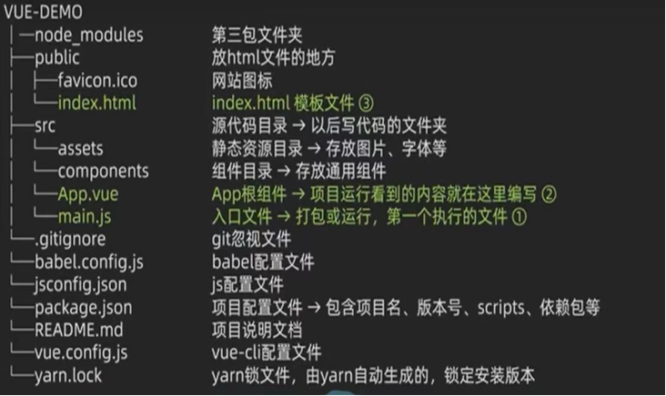
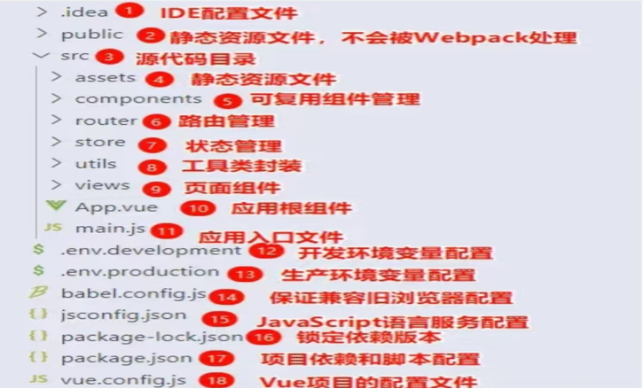
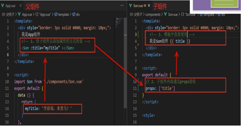
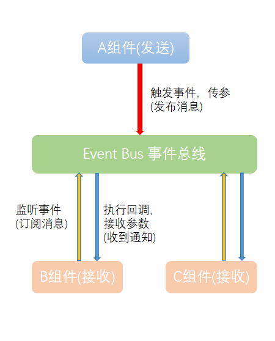
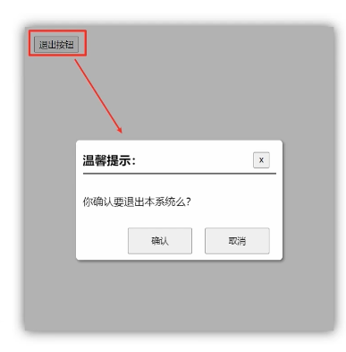
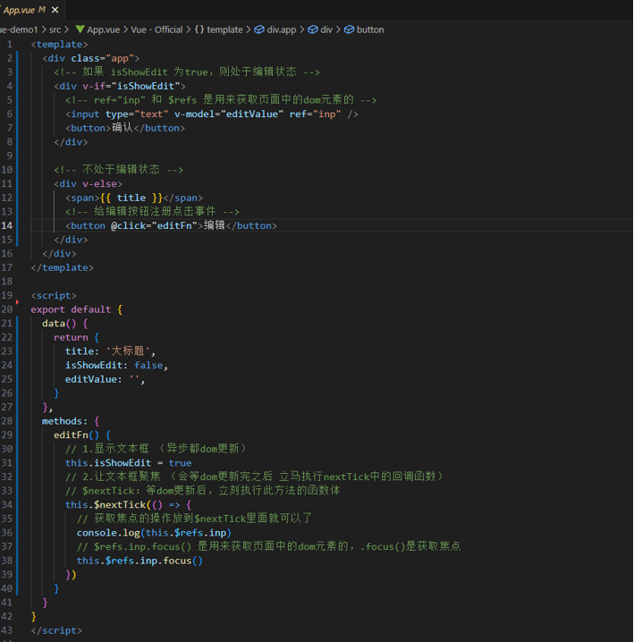
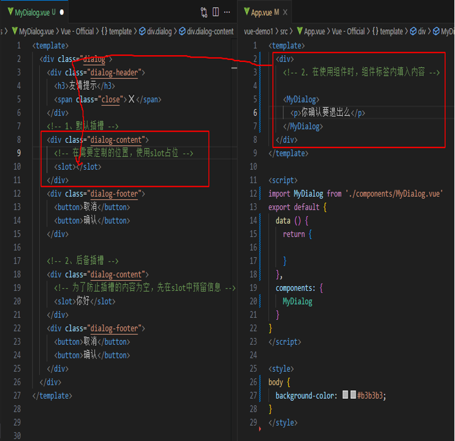

### vue弹窗
```
<div id="app">
    <button @click="change">显示</button>

    <div class="pop" v-show="isshow">
        <div class="box">
            <h1>我是弹窗</h1>
            <!-- 注册点击事件，一点击就关闭弹窗 -->
            <button @click="hidePopup">关闭</button>
        </div>
    </div>
</div>
```
<br>

```
<script>
    const app = new Vue({                                        
        el:'#app',                                               
        data:{
            isshow: false
        },
        methods:{
            change ( ) {
                this.isshow = true
                console.log('打开了弹窗')
            },
            hidePopup( ){
                this.isshow = false
                console.log('关闭了弹窗')
            },
        }
    })
</script>
```
<br>

```
<style>
     .pop {
        position: fixed; /* 固定定位，不随页面滑动变化 */
        left: 0;
        top: 0;
        width: 100%;
        height: 100%;
        background-color: rgba(0, 0, 0, 0.2); /* 半透明背景 */
    }
    .box {
        width: 200px;
        height: 200px;
        background-color: #fff;
        /* 弹窗始终居中于页面 */
        position: fixed; /* 固定定位，不随页面滑动变化 */
        left: 50%;
        top: 40%;
    }
</style>
```

<hr>

### 创建Vue实例，初始化渲染
核心步骤<br>
1、准备容器（Vue所管理的范围）<br>
2、引包。引入开发版本的包<br>
```
<script src="https://cdn.jsdelivr.net/npm/vue@2.7.14/dist/vue.js"></script>
```
3、创建实例<br>
4、添加配置项 => 完成渲染 
```
const app = new Vue({                                        
    el:'#app',                                               
    data:{
        msg:'hello 黑马',
        count:666
    }
})
```
<span style="color: red;">解析</span>
<br>
el:'类名'                      →表示：指定挂载点<br>
data:{数据}                    →表示：把数据写在这里
<hr>

### 插值表达式
作用：利用表达式进行插值，渲染到页面<br>
<span style="color: red;">响应式特性</span>
1、通过控制台操作数据的方法有：<br>
（1）访问数据：实例.属性名<br>
（2）修改数据：实例.属性名=新值<br>

语法：<code>{{ 表达式 }}</code><br>
```
<div id="app">
    <p>姓名：{{ nickname }}</p>
</div> 
<!-- js -->
<script>
    const app = new Vue({
        el:'#app',
        data:{
            nickname:'hello',
            age:17,
            friend:{
                name:'唐茂凯',
                desc:'热爱睡觉'
            }
        }
    })
</script>
```
拓展
```
{{ nickname.toUpperCase() }}              →大写
{{ nickname + '你好'}}                    →拼接字符串
{{ age >=18 ? '成年' : '未成年' }}        →是否成年
{{ friend.name }}                         →朋友
```
<span style="color: red;">错误写法</span>

```
（1）使用的数据在data中必须存在
<p>{{ hobby }}</p>
（2）只支持表达式，不支持语句
<p>{{ if }}</p>
（3）不能在标签属性中使用  {{ }}  插值
<p title="{{ name }}">我是</p>
```
<br>
<hr>

### vue指令大全
```
<div id="app">
    <div v-html="msg"></div>
    <div v-show="true">盒子1</div>
    <div v-if="true">盒子2</div>
    <div v-if="gender === 1">男</div>
    <div v-else>女</div>
</div>
<script>
    const app = new Vue({
        el:'#app',
        data:{
            msg:'<a href="#">点击一下</a>',
            gender:1
        }
    })
</script>
```
<br>
<code>v-html</code><br>
作用：设置元素的innerHTML<br>
语法:

```
v-html=”表达式”
```
<br>

<code>v-show</code><br>
作用：控制元素的显示隐藏<br>
语法:
```
v-show=”表达式” （表达式值为true显示，false隐藏）
```
场景：需要频繁切换显示隐藏的场景，比如：小米官网首页购物车
<br>

<code>v-if</code><br>
作用：控制元素的显示隐藏<br>
语法:
```
v-if=”表达式” （表达式值为true显示，false隐藏）
```
场景：不需要频繁切换显示隐藏的场景，要么显示，要么隐藏，比如：小米官网首页显示是否已经登录
<br>

<code>v-else和v-else-if</code><br>
作用：辅助v-if进行判断渲染<br>
语法:
```
v-else   v-else-if=”表达式”
```
注意：需要紧挨着 v-if 一起使用
<br>

<code>v-on</code><br>
作用：注册事件 = 添加事件 + 提供处理逻辑<br>
语法:
```
（1）v-on:事件名=”内联语句”  （简写：@事件名=”内联语句”）
（2）v-on:事件名=“methods中的函数名”
```
<br>

```
<div class="b" id="app">
    <div class="box1">
        <button v-on:click="count--">-</button>
        <span>{{ count }}</span>
        <button v-on:click="count++">+</button>
    </div>
    <div class="box2">
        <button @click="fn">显示隐藏</button>
        <span v-show="isshow">唐茂凯</span>
    </div>
</div>
<script>
    const app = new Vue({
        el:'#app',
        data:{
            count:0,
            isshow:true
        },
        methods:{
            fn() {
                this.isshow = !this .isshow
            }
        }
    })
</script>
```
<br>

<code>v-on 调用传参</code><br>

```
<div id="app">
    <button @click="buy(5)">可乐5元</button>
    <button @click="buy(10)">饮料10元</button>
    <p>账户余额：{{ money }}</p>
</div>
<script>
    const app = new Vue({
        el:'#app',
        data:{
            money:100
        },
        methods:{
            buy (price) {
                this.money -= price
            }
        }
    })
</script>
```
<br>

```
<div id="app">
    
    <ul v-for="item in list" :key="item.id">
        <li>{{ item.name }}</li>
    </ul>
</div>
<script>
    const app = new Vue({
        el:'#app',
        data:{
            imgurl:'/blog/img/小米logo.jpg',
            list: [
                {id:1 ,name:"你好"},
                {id:2 ,name:"你们好"}
            ]
        }
    })
</script>
```
<br>

<code>v-bind</code><br>
作用：动态的设置html的标签属性 → src url title ... <br>
语法:
```
v-bind:属性名=”表达式”
```
<br>
简写:

```
:属性名="表达式"
```
<br>
<code>v-bind 对于样式控制的增强 - 操作class</code><br>
语法：

```
v-bind:class='对象'
```
简写
```
:class='对象/数组'
```
<br>
1、对象 <br>
键就是类名，值就是布尔值。如果为true就有这个类，否则就没有<br>
场景：一个类名来回切换，比如：京东购物导航<br>
2、数组 <br>
数组中所有的类，都会添加到盒子上，本质就是一个class列表<br>
语法：<code>:class='[‘ping' ,'big' ]'</code><br>
场景：批量添加或删除类<br>
示例：

```
<style>
    .box{
        width: 200px;
        height: 200px;
        border: 2px solid rgb(45, 191, 239);
    }
    .pink{
        background-color: #64ec7d;
    }
    .big{
        width: 300px;
        height: 300px;
    }
</style>
<div id="app">
    <div class="box" :class="{ pink: true, big:false}">gfsdg</div>
    <br>
    <div class="box" v-bind:class="['pink','big']"></div>
</div>

```
<br>

<code>v-for</code><br>
作用：数据循环，多次渲染整个元素 →数组、对象、数字 ....<br>
语法:
```
v-for=”"item in 数组”
```
（item表示每一项，index表示下标）
<br>

<code>v-for中的key</code><br>
作用：给元素添加的唯一标识，便于Vue进行列表的正确排序复用。<br>
语法:
```
key:“唯一标识”
```
注意：
1、key的值只能是字符串或数字类型
2、key的值不须具有唯一性
3、推荐使用id作为ley（唯一）
<br>

<code>v-model</code><br>
作用：给表单使用双向绑定，可以快速获取和设置表单元素<br>
(1)数据变化，视图自动更新<br>
(2)视图变化，数据自动更新<br>
语法:
```
v-model='变量'
```
<br>

```
<div id="app"> 
    账户：<input type="text" v-model="username">
    密码：<input type="password" v-model="password">
    <button @click="login">登录</button>
    <button @click="reset">重置</button>
</div>
```
<br>

```
<script>
    const app = new Vue({
        el: '#app',
        data: {
            username: ' ',
            password: ' '
        },
        // 以下是登陆按钮动作
        methods:{
            login(){
                alert(
                    '账号:'+this.username  + ','
                    +'密码:'+this.password
                    )
            },
            // 以下是重置按钮动作
            reset () {
                this.username = '',
                this.password = ''
            }
        }
    })
</script>
```
<br>

### 修饰符
按键修饰符
```
@keyup.enter             →键盘回车监听
```
v-model修饰符
```
v-model.trim             →去除首尾空格
v-model.number           →转数字
```
事件修饰符
```
@事件名.stop             →阻止冒泡
@事件名.prevent          →阻止默认行为
```
<br>
<hr>

###  计算属性
概念:基于现有的数据，计算出来的新属性。依赖的数据变化，自动重新计算。<br>
语法:<br>
① 声明在 computed 配置项中，一个计算属性对应一个函数<br>
② 使用起来和普通属性一样使用{{计算属性名 }}<br>
计算属性 → 可以将一段 求值的代码 进行封装<br>
```
computed:{
    计算属性名(){
        基于现有数据，编写求值逻辑
        return 结果
    }
}
```
举例
```
<div id="app" class="box">
        <h3>小黑的礼物清单</h3>
        <table>
            <tr>
                <td>名字</td>
                <td>数量(个)</td>
            </tr>
            <tr v-for="item in list" :key="item.id"> 
                <td>{{item.name}}</td>
                <td>{{item.num}}</td>
            </tr>
        </table>    <!-- 共计 -->
    <p>礼物共计：{{ totalCount }}个</p>
</div>
```
<br>

```
<script>
    const app = new Vue({
        el:'#app',
        data:{
            list:[
                {id: 1,name:'篮球',num:1},
                {id: 2,name:'排球',num:3},
                {id: 3,name:'足球',num:5},
            ]
        },
        computed:{
            totalCount() {
                let total = this.list.reduce((sum, item)=> sum + item.num, 0)
                return total
            }
        }
    })
</script>
```

### computed 计算属性 vs methods 方法
computer 计算属性：<br>
作用：封装了一段对于数据的处理，求得一个结果。<br>
语法:<br>
① 写在 computed 配置项中<br>
② 作为属性，直接使用 → this.计算属性 {{ 计算属性 }}<br>

methods 方法：<br>
作用：给实例提供一个方法，调用以处理业务逻辑。<br>
语法:<br>
① 写在 methods 配置项中<br>
② 作为属性，需要调用 → this.方法名( ) {{ 方法名( ) }} @事件名=”方法名”<br>

缓存特性(提升性能)：<br>
计算属性会对计算出来的结果缓存，再次使用直接读取缓存，依赖项变化了，会自动重新计算 →并再次缓存

### watch 侦听器(监视器)
① 简单写法 → 简单类型数据，直接监视
```
watch: {
    数据属性名 (newValue, oldValue) {
        一些业务逻辑 或 异步操作
    },
    '对象.属性名' (newValue, oldValue) {
        一些业务逻辑 或 异步操作
    }
}
```
② 完整写法 → 添加额外配置项
```
watch: {                             // watch 完整写法
    数据属性名: {
        deep: true,
        immediate: true,             // 深度监视
        handler(newValue) {
            console.log(newValue)    // 是否立即执行一次 handler
        }
    }
}
```

### vue2脚手架目录文件介绍

### vue3脚手架目录文件介绍

vue引用img图片的方法
```
HTML格式： 
vue格式： 
```

黑马 —— 041(1)：创建项目<br>
步骤一：复制一份【src】文件出来并把原来的【src】文件命名改掉（因为项目运行的是【src】文件）<br>
步骤二：完整代码写在【APP.vue】文件里，拆分出来的组件放在【components】文件里面 <br><br>
黑马 —— 041(2)启动vue项目步骤<br>
步骤一： cd D:\code\VSCode\练习本\vue\demo\vue-demo1<br>
步骤二： npm run dev<br>
停止服务器运行的快捷键：【Ctrl+C】
<hr>

### 组件通信
组件通信,就是指 组件与组件 之间的数据传递<br>
组件的数据是独立的，无法直接访问其他组件的数据。<br>
想用其他组件的数据 →组件通信<br>
组件的关系分类<br>
<br>
组件通信解决方案（Vuex）：<br>
1、父子关系：props (父传子) 和 $emit (子传父)<br>
2、非父子关系：provide & inject或evenbus<br>
prop & data、单向数据流（口诀：谁的数据谁负责）<br>
共同点:都可以给组件提供数据。<br>
区别:<br>
data 的数据是自己的 → 随便改<br>
prop 的数据是外部的 →不能直接改，要遵循 单向数据流<br>
单向数据流:父级 prop 的数据更新，会向下流动，影响子组件。这个数据流动是单向的。<br>

#### props (父传子)
<br>

#### $emit (子传父)
<br>

### 非父子通信(拓展)- event bus 事件总线
作用：非父子组件之间的数据进行简易信息传递<br>
步骤1、创建一个能访问到的事件总线（空Vue实例） →utils/EventBus.js
```
import Vue from "vue";
const Bus = new Vue()
export default Bus
```
步骤2、A组件(发送)，触发Bus实例的事件  →components/BaseOne.vue
```
import Bus from '../utils/EvenBus.js'    //导入Bus
export default {
  methods: {
        clickSend () {
               Bus.$emit('sendMsg' , '今天天气真好');
}
   },
}
```
步骤3、B组件(接收)  添加 $on 监听事件来监听 Bus 实例的事件  →components/BaseTwo.vue
```
created () {
    //Bus.监听事件('事件名' , (接收回调的消息) => {回调操作})
    Bus.$on('sendMsg',(msg) => {
      this.msg = msg
      console.log(msg)
    })
  },
```


###  .sync修饰符
作用：可以实现子组件与父组件数据的双向绑定，简化代码<br>
特点：prop属性名，可以自定义，非固定为value<br>
场景：封装弹框类的基础组件，visible属性 true显示 flase隐藏<br>
本质：就是 :属性名 和 @update:属性名 合写<br>
子组件（封装）

```
<BaseDialog :visible.sync="isShow" />
-------------------------------------
<BaseDialog
    :visible="isShow"
    @update:visible="isShow = $event"
/>
```
父组件（使用）
```
props: {
    visible: Boolead
},

this.$emit('update:visible', false)
```
效果图<br>

<br>
<hr>

### Vue异步更新、$nextTick
需求：编辑标题，编辑框自动聚焦<br>
1、点击编辑，显示编辑框<br>
2、让编辑框立即自动聚焦<br>
想要在 DOM 更新完成之后做某件事，可以使用$nextTick<br>
$refs.inp.focus() 是用来获取页面中的dom元素的，.focus()是获取焦点0
```
this.$nextTick(() => {
//业务逻辑
}
```

详细代码如下：
```
<template>
  <div class="app">
    <div v-if="isShowEdit">
      <input type="text" v-model="editValue" ref="inp" />
      <button>确认</button>
    </div>

    <div v-else>
      <span>{{ title }}</span>
      <button @click="editFn">编辑</button>
    </div>
  </div>
</template>

<script>
export default {
  data() {
    return{
      title: '唐茂凯',
      isShowEdit: false,
      editValue: '',
    }
  },
  methods: {
    editFn() {
      this.isShowEdit = true
      this.$nextTick(() => {
        console.log(this.$refs.inp)
        this.$refs.inp.focus()
      })
    }
  }
}
</script>

<style></style>
```

<br>
<hr>

### 插槽-默认插槽
作用：让组件内部的一些结构支持自定义。<br>
需求：要在页面中显示一个对话框，封装成一个组件<br>
插槽的基本语法：<br>
1、组件内需要定制的结构部分，改用```<slot></slot>```占位<br>
2、使用组件时，```<MyDialog></MyDialog>```标签内部，传如结构替换slot<br>

### 插槽-后备内容（默认值）
插槽后备内容：封装组件时，可以为预留的```<slot>```插槽提供后备内容（默认内容）。<br>
效果：<br>
1、外部使用组件时，不传东西，则slot会显示后备内容<br>
2、外部使用组件时，传东西了，则slot整体会换掉<br>


### 插槽-具名插槽
需求：一个组件内有多处结构，需要外部传入标签，进行定制<br>
步骤：<br>
1、给插槽起上对应的名字<br>
2、用v-slot来指定绑定对应的插槽<br>


### 插槽-作用域插槽
定义slot插槽的同时，是可以传值的。只需要给插槽上绑定<br>数据，将来使用组件时<br>
场景：封装表格组件<br>
1、父传子，动态渲染表格内容
2、利用默认插槽，定制操作列
3、删除或查看都需要用到当前项的id，属于组件内部的数据通过作用域插槽传值绑定，进而使用
```
<MyTable :list="list">
    <button>删除</button>
</MyTable>

<MyTable :list="list2">
    <button>查看</button>
</MyTable>
```
基本使用步骤：
1、给slot标签，以添加属性的方式传值
```
<slot :id="item.id" msg="测试文本"></slot>
```
2、所有添加的属性，都会被收集到一个对象中
```
{ id:3, msg: '测试文本' }
```
3、在template中，通过`#插槽名="obj"`接收，默认插槽名为default
```
<MyTable :list="list">
    <template #default="obj">
        <button @click="del(obj.id)">删除</button>
    </template>
</MyTable>
```


